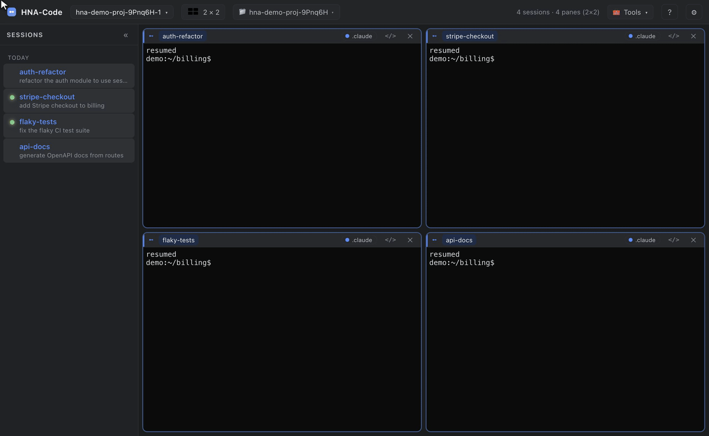

<h1 align="center">HNA-Code — mission control for coding agents</h1>

<p align="center"><b>Humans and Agents Code.</b> Run many <a href="https://claude.ai/code">Claude Code</a> sessions at once in a live grid — each cell glows the moment its agent needs you, across multiple accounts, and the whole board resumes after a restart.</p>

> 🔥 **v0.3.0 — Multiple Claude accounts.** Run several Claude logins side by side, see which account each cell is burning, and move a live session between accounts with one click. [Download](https://github.com/tyhh00/HNA-Code/releases/tag/v0.3.0) · [Release notes](https://github.com/tyhh00/HNA-Code/releases/tag/v0.3.0)
>
> 🧭 **Built for Claude Code today, designed for more.** The vision is to make agentic coding — Claude Code, Codex, any harness — dramatically more productive by giving you one place to command a whole fleet of agents. Claude Code is the first fully supported harness.

<p align="center">
  <!-- HERO GIF: the glowing grid in action (rendered by the demo pipeline into docs/media) -->
  
</p>

<p align="center">
  <a href="https://github.com/tyhh00/HNA-Code/releases"></a>
  <a href="LICENSE"></a>
  
  
</p>

## What is HNA-Code

When you run more than one or two coding agents, the terminal stops scaling. You lose track of which session is waiting on you, which is mid-task, and which folder each one belongs to — and closing the window loses the lot.

HNA-Code is a desktop app that turns that chaos into a **board**. Every cell is a real terminal running `claude`, laid out in a grid you choose. A cell **glows** the instant its agent finishes a turn or needs a permission — so you tend the ones that need you and let the rest work. Close the app and reopen it: every conversation resumes exactly where it left off, in its own folder, with its name and glow intact.

And because heavy users run more than one Claude account, HNA-Code makes accounts first-class: each cell shows which account it's running as, and you can move a session to another account when one runs low — without losing the conversation.

## Demo

The clips below are the real UI — recorded and rendered by the pipeline in [`demo/`](demo).

**Glow when a session needs you.** A session finishes, its cell glows **amber**, and it jumps to the top of the **needs-you** sidebar. Breathing **blue** means it's blocked on a permission. Type into a cell and its glow clears — and the whole board resumes after a restart. *(That's the hero above.)*

### Many accounts, one board

<p align="center">
  
</p>

Each cell carries a colour-coded badge for the Claude account it runs as. Click it to move that session to another account — HNA-Code copies the conversation across, resumes it there, and keeps the original as a rollback. Colour-code accounts so you can tell at a glance which one each cell is spending.

### Bring your existing sessions in

<p align="center">
  
</p>

Point HNA-Code at a folder and it finds the Claude sessions you already have there. Resume them into the grid in one click — they open one at a time so you can see the board fill up, and when there are more than the grid fits, it asks whether to open extra windows or stack the rest as tabs.

### Layouts and the needs-you sidebar

<p align="center">
  
</p>

Landscape layouts (2×4, 3×4, 4×4) and portrait layouts for vertical monitors (4×2, 6×2, 8×2, 6×1). Shrinking the grid never kills a session — orphaned ones fold into tabs. The sidebar pins whatever needs you to the top and jumps you straight there.

## Why HNA-Code

Agentic coding is fast, but a single agent leaves you waiting on it. The obvious move is to run several at once — and that's exactly where the plain terminal falls apart:

- **You miss the hand-off.** An agent finishes, or blocks on a permission, and sits idle because you were looking at another tab. HNA-Code glows it and surfaces it in the sidebar.
- **You lose your place.** A crash or a restart wipes a dozen conversations. HNA-Code resumes the whole board — real `claude --resume`, in each session's own folder.
- **You run out of usage.** One account hits its limit mid-task. HNA-Code lets you move that session to another account with a click and keep going.

It's not a headless orchestrator that runs agents *for* you — it's the command surface that keeps *you* in the loop over many agents at once.

## Quick start

### Download

Grab a build from the [Releases](https://github.com/tyhh00/HNA-Code/releases) page — macOS `.dmg`, Windows `.exe`, Linux `.AppImage`. Builds are **unsigned** (this is a free, open-source project), so the OS warns on first launch:

- **macOS:** right-click the app → **Open** (once), or run `xattr -dr com.apple.quarantine /Applications/HNA-Code.app`.
- **Windows:** SmartScreen → **More info** → **Run anyway**.

You'll also need [Claude Code](https://claude.ai/code) installed and on your `PATH` (`claude`).

### Run from source

```bash
npm install
npm start
```

Glow and resume work out of the box — the app installs its Claude Code hooks on startup and learns each session id as it starts.

## Features

- **Grid of live terminals.** One real PTY per cell running `claude`. Landscape and portrait layouts; shrinking the grid folds orphaned sessions into tabs instead of killing them.
- **Glow when a session needs you.** Amber when a turn ends, breathing blue when a permission is pending; typing clears it. Optional per-event sounds.
- **Autosave and resume.** Every cell resumes its exact conversation (`claude --resume`) in its original folder, with its name and glow, after a restart or crash.
- **Multiple Claude accounts.** Auto-discovers `CLAUDE_CONFIG_DIR` profiles, shows each cell's account as a colour-coded badge, and moves a session between accounts on click. Add or hide directories and set per-account colours in Settings.
- **One-click import.** Pull the Claude sessions already in a folder into the grid — all, a selection, or only ones after a date — with staggered opening and an overflow prompt.
- **Needs-you-first sidebar.** A live list of your real sessions, whatever needs you pinned on top, click to jump.
- **Editable names, recent folders, open-in-VS-Code, themeable, broadcast-to-all-cells.**
- **Your config stays yours.** Glow hooks are added to each account's `settings.json`; only HNA-Code's entries are touched, and you can disconnect.

## How it works

```
 Electron main                                   each cell
 - one PTY per cell (runs claude)                <shell> -> claude --resume <id>
 - 127.0.0.1 signal server (+ per-run token)             |
 - per-window state (layout, names, glow,                | hook POSTs {cell, session_id, kind}
   sessions, account binding)                            v
 Renderer                                        signal.sh / signal.ps1
 - xterm.js grid, glow, sidebar, settings        (SessionStart / Stop / idle / permission)
```

- Each cell spawns with `CC_CELL_ID`, the signal server's port + token, and — for a profile-bound cell — its account's `CLAUDE_CONFIG_DIR`.
- A small hook (`src/hooks/signal.sh`, or `signal.ps1` on Windows) posts `{cell, session_id, kind}` back to the app on SessionStart, Stop, idle, and permission. That's how the app learns each cell's session id race-free and knows when to glow.
- State is written atomically and debounced, so a crash leaves the last good board.

See [`docs/ARCHITECTURE.md`](docs/ARCHITECTURE.md) for the full design.

## Compatibility

- **Cross-platform:** macOS, Windows, Linux. The PTY ships prebuilt for all three (no compiler needed).
- **Claude Code hooks tested against `2.1.x`.** Glow and resume rely on the hook schema (SessionStart, the Notification matchers `idle_prompt` / `permission_prompt`, Stop, and `claude --resume`). If a future release changes them, glow degrades gracefully rather than breaking. PRs that widen the tested range are very welcome.

## Tests

```bash
npm test
```

Every feature is verified by driving the real app with Playwright (screenshots plus terminal-buffer assertions).

| Test | Covers |
|------|--------|
| `test/hooks.cjs` | settings.json merge preserves your own hooks; idempotent; clean uninstall |
| `test/smoke.mjs` · `test/grid.mjs` | live terminals, real PTY round trip, layout switching |
| `test/signal.mjs` · `test/glow.mjs` | hook round trip, cell correlation; done→amber, permission→blue, keystroke clears |
| `test/persist.mjs` · `test/settings.mjs` | autosave/resume of names, glow, sessions, cwd; settings survive restart |
| `test/multiwindow.mjs` · `test/tabs.mjs` · `test/workspaces.mjs` | multi-window, tab stacking, per-folder windows |
| `test/sidebar.mjs` · `test/home.mjs` | needs-you-first sidebar; first-run home page and recents |
| `test/import.mjs` · `test/import-manual.mjs` | one-click import and the cross-folder Settings importer |
| `test/accounts.mjs` | multi-account: discovery, switch, source-of-truth/dedupe, empty-cell handling |
| `test/overflow.mjs` | staggered bulk resume and the overflow prompt |

## Building and releasing

```bash
npm run pack:mac      # macOS: dist/HNA-Code-<version>.dmg + .zip (run on a Mac)
npm run pack:portable # Windows: single-file portable .exe
npm run pack:linux    # Linux: .AppImage
```

Each OS builds only its own installers, so cross-building happens in CI: pushing a `vX.Y.Z` tag runs [`.github/workflows/release.yml`](.github/workflows/release.yml), which builds unsigned artifacts on macOS, Windows and Linux runners and attaches them to the GitHub Release — free, no store fees. Code-signing (to remove the first-launch OS warning) is optional electron-builder config, not required for a personal or OSS build.

## Contributing

Issues and pull requests welcome. Good first areas: widening the tested Claude Code version range, more layouts, packaging, and support for additional agent harnesses.

## License

[MIT](LICENSE)
